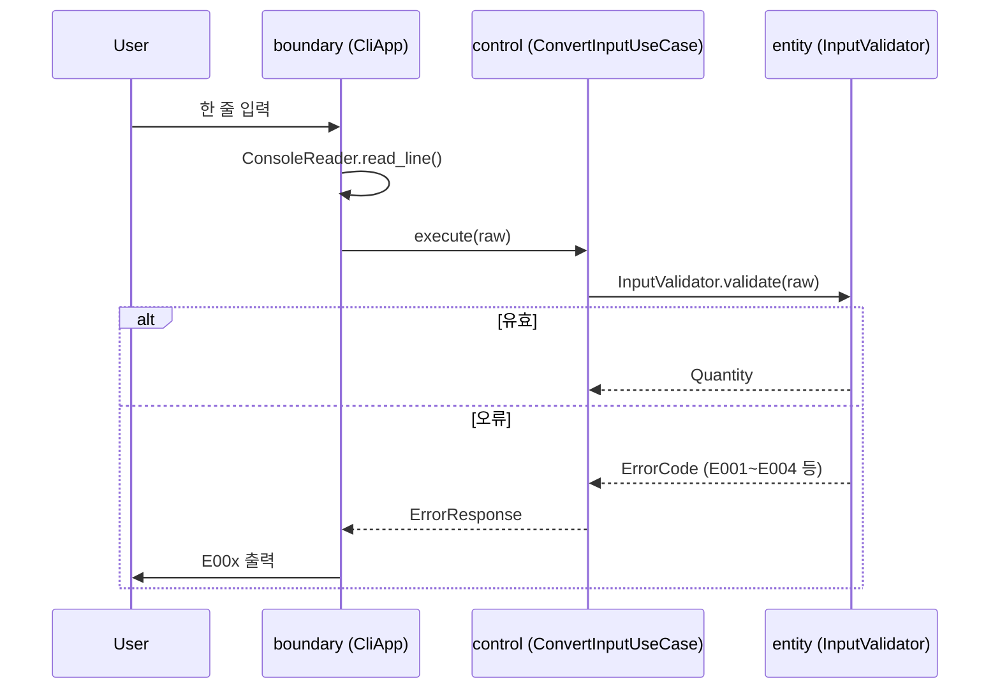
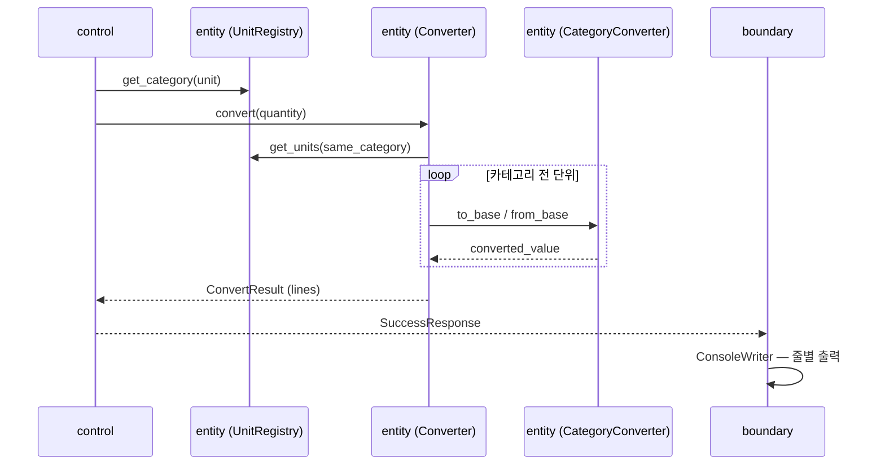
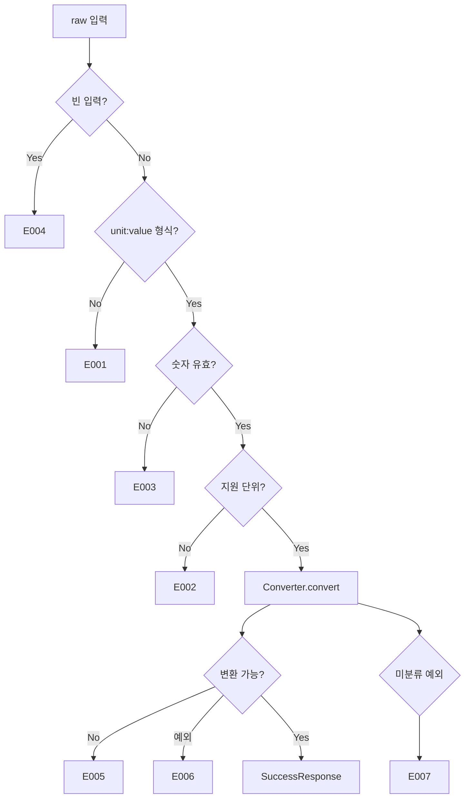

# UnitConverter_23 — Architecture Document

**프로젝트:** UnitConverter_23  
**아키텍처:** ECB (Entity — Control — Boundary)  
**문서 버전:** 1.0  
**작성일:** 2026-06-05  
**관련 문서:** [PRD.md](PRD.md), [AGENTS.md](../AGENTS.md)

---

## 1. 아키텍처 개요

UnitConverter_23는 **ECB 3계층**으로 구성한다.  
외부(CLI)와의 접점은 **boundary**, 유스케이스 조율은 **control**, 순수 도메인 로직은 **entity**가 담당한다.

```
┌─────────────────────────────────────────────────────────┐
│  boundary          CLI · stdin/stdout · 출력 포맷        │
└───────────────────────────┬─────────────────────────────┘
                            │ 호출
                            ▼
┌─────────────────────────────────────────────────────────┐
│  control           파싱 조율 · 변환 유스케이스 · DTO     │
└───────────────────────────┬─────────────────────────────┘
                            │ 호출
                            ▼
┌─────────────────────────────────────────────────────────┐
│  entity            단위·변환·검증 · SSOT · 오류 도메인   │
│                    (외부 I/O · 상위 레이어 의존 없음)    │
└─────────────────────────────────────────────────────────┘
```

**의존 방향:** `boundary → control → entity` (단방향)

---

## 2. SOLID 원칙 적용

| 원칙 | 적용 |
|------|------|
| **S — Single Responsibility** | entity는 변환·검증만, control은 유스케이스 조율만, boundary는 입출력만 담당 |
| **O — Open/Closed** | 신규 단위·카테고리는 `UnitRegistry` / `CategoryConverter` 확장으로 추가; 기존 `Converter` 핵심 수정 최소화 |
| **L — Liskov Substitution** | 카테고리별 변환 전략(`LinearCategoryConverter`, `TemperatureConverter` 등)은 동일 인터페이스로 교체 가능 |
| **I — Interface Segregation** | boundary는 control의 좁은 진입 API만 사용; entity는 I/O 인터페이스에 의존하지 않음 |
| **D — Dependency Inversion** | boundary → control, control → entity 순서 유지; entity는 어떤 상위·I/O 추상화에도 의존하지 않음 |

**entity 순수성 원칙:** entity는 `input()`, `print()`, 파일, 네트워크, 환경 변수 등 **모든 외부 입출력에 의존하지 않는다.**  
입력 문자열·숫자 값은 **control이 인자로 전달**하고, entity는 **결과 객체만 반환**한다.

---

## 3. 계층별 책임

### 3.1 entity (Entity Layer)

| 책임 | 설명 |
|------|------|
| 도메인 모델 | `Unit`, `Category`, `Quantity`, `ConversionLine` |
| SSOT | 변환 계수·Base Unit·단위 문자열 — `UnitRegistry`, `ConversionFactors` |
| 입력 검증 (도메인) | 빈 값, 형식, 숫자, 지원 단위 판별 → `ErrorCode` |
| 변환 | Base Unit 경유, 카테고리별 전략, **결정적** 결과 |
| 오류 표현 | E001~E007를 나타내는 `ErrorCode` / `DomainError` |

**하지 않는 것:** stdin/stdout, CLI 포맷, control/boundary import, 외부 라이브러리

---

### 3.2 control (Control Layer)

| 책임 | 설명 |
|------|------|
| 유스케이스 | `ConvertInputUseCase` — 입력 한 줄 → 변환 결과 또는 오류 |
| 조율 | entity의 `InputValidator`, `Converter` 호출 순서 정의 |
| DTO 변환 | entity 결과 → boundary에 전달할 `ConvertResponse` |
| 예외 매핑 | entity 예외·내부 실패 → **E006**, 미분류 → **E007** |

**하지 않는 것:** 직접 stdin/stdout 접근, 변환 계수 하드코딩, entity 우회 변환

---

### 3.3 boundary (Boundary Layer)

| 책임 | 설명 |
|------|------|
| CLI 진입점 | `main()`, 프로그램 시작·종료 |
| 입력 수집 | `ConsoleReader` — 한 줄 읽기 |
| 출력 | `ConsoleWriter` — `<unit>:<value>` 또는 E00x 출력 |
| control 위임 | `CliApp` — reader → control → writer 연결 |

**하지 않는 것:** entity 직접 import, 변환 로직, SSOT 정의

---

## 4. 의존성 규칙

### 4.1 허용 / 금지

| from \ to | entity | control | boundary |
|-----------|--------|---------|----------|
| **entity** | ✅ 내부 | ❌ | ❌ |
| **control** | ✅ | ✅ 내부 | ❌ |
| **boundary** | ❌ | ✅ | ✅ 내부 |

### 4.2 추가 제약

| 규칙 | 내용 |
|------|------|
| R1 | entity는 **표준 라이브러리만** 사용 (외부 패키지 금지) |
| R2 | 변환 계수·단위 문자열 **중복 정의 금지** — `UnitRegistry` SSOT |
| R3 | boundary는 control **공개 API**만 호출 |
| R4 | 테스트에서 Logic Track은 entity/control **실객체** 사용 (Domain Mock 금지) |

---

## 5. 주요 클래스 설계

### 5.1 entity

```
entity/
├── constants.py          # ErrorCode (E001~E007), Category enum
├── unit_registry.py      # UnitRegistry — SSOT: 단위·카테고리·계수
├── conversion_factors.py # ConversionFactors — Base Unit 대비 계수 (SSOT)
├── models.py             # Unit, Quantity, ConversionLine, ConvertResult
├── input_validator.py    # InputValidator — 도메인 입력 검증
├── converter.py          # Converter — 카테고리 전 단위 변환 조율
├── category/
│   ├── base.py           # CategoryConverter (Protocol/ABC)
│   ├── linear.py         # LinearCategoryConverter (Length, Weight, Area, Volume)
│   └── temperature.py    # TemperatureConverter (비선형)
└── errors.py             # DomainError, ErrorCode
```

| 클래스 | 책임 | SOLID |
|--------|------|-------|
| `ErrorCode` | E001~E007 상수 | SRP |
| `UnitRegistry` | 지원 단위·카테고리·출력 순서 SSOT | SRP, SSOT |
| `ConversionFactors` | Base Unit 대비 계수 SSOT | SRP, OCP |
| `InputValidator` | `raw: str` → `Quantity` 또는 `ErrorCode` | SRP |
| `Converter` | `Quantity` → `list[ConversionLine]` | SRP, OCP |
| `LinearCategoryConverter` | 선형 카테고리 변환 | LSP, OCP |
| `TemperatureConverter` | celsius/fahrenheit/kelvin 공식 | LSP, OCP |
| `ConvertResult` | 성공(줄 목록) / 실패(ErrorCode) 결과 타입 | SRP |

**핵심 API (개념):**

```python
# entity — I/O 없음, 순수 함수·객체
InputValidator.validate(raw: str) -> Quantity | ErrorCode
Converter.convert(quantity: Quantity) -> ConvertResult
UnitRegistry.get_units(category) -> list[Unit]
```

---

### 5.2 control

```
control/
├── convert_use_case.py   # ConvertInputUseCase
├── dto.py                # ConvertResponse, SuccessResponse, ErrorResponse
└── error_mapper.py       # ErrorMapper — 예외 → E006/E007
```

| 클래스 | 책임 |
|--------|------|
| `ConvertInputUseCase` | `execute(raw: str) -> ConvertResponse` |
| `ConvertResponse` | 성공 시 `lines: list[str]`, 실패 시 `code: ErrorCode` |
| `ErrorMapper` | 예상치 못한 예외 → E006 / E007 |

---

### 5.3 boundary

```
boundary/
├── cli_app.py            # CliApp — run loop
├── console_reader.py     # ConsoleReader.read_line()
├── console_writer.py     # ConsoleWriter.write_lines() / write_error()
└── main.py               # 진입점
```

| 클래스 | 책임 |
|--------|------|
| `CliApp` | reader → use_case.execute → writer |
| `ConsoleReader` | stdin에서 한 줄 읽기 (I/O 캡슐화) |
| `ConsoleWriter` | stdout에 `<unit>:<value>` 또는 E00x 출력 |

---

## 6. 입력 처리 흐름



| 단계 | 레이어 | 동작 |
|------|--------|------|
| 1 | boundary | stdin에서 `raw` 문자열 수집 |
| 2 | control | `execute(raw)` 호출 |
| 3 | entity | E004(빈 입력) → E001(형식) → E003(숫자) → E002(단위) 순 검증 |
| 4 | control | `ErrorCode` 또는 `Quantity`를 `ConvertResponse`로 포장 |
| 5 | boundary | 오류 시 E00x만 출력 후 종료 |

---

## 7. 단위 변환 흐름



| 단계 | 설명 |
|------|------|
| 1 | `Quantity(unit, value)` 확정 |
| 2 | `UnitRegistry`에서 unit의 **Category** 조회 |
| 3 | 동일 Category의 **전 지원 단위** 목록 조회 (출력 순서 SSOT) |
| 4 | 입력값 → **Base Unit** → 각 대상 단위 (카테고리 전략 사용) |
| 5 | `ConversionLine(unit, value)` 목록 생성 — **결정적** |
| 6 | boundary가 `<unit>:<value>` 형식으로 stdout 출력 |

**Base Unit (SSOT):**

| Category | Base Unit |
|----------|-----------|
| Length | meter |
| Weight | g |
| Temperature | celsius |
| Area | sqm |
| Volume | liter |

---

## 8. 오류 처리 흐름



| ErrorCode | 주 담당 레이어 | boundary 출력 |
|-----------|----------------|---------------|
| E001~E004 | entity (`InputValidator`) | `E001` … `E004` |
| E005 | entity (`Converter` / Registry) | `E005` |
| E006 | control (`ErrorMapper`) | `E006` |
| E007 | control (`ErrorMapper`) | `E007` |

**규칙:**

- entity는 **ErrorCode만 반환** — print/로깅 없음
- control은 entity `ErrorCode`를 **그대로** boundary에 전달
- boundary는 **변환 결과 없이** E00x만 출력 (PRD AC-06)

---

## 9. 테스트 전략 (Dual-Track)

### 9.1 Logic Track — Domain / Control

| 항목 | 규칙 |
|------|------|
| 파일 | `tests/test_d_*.py` |
| ID | D-* (reference.md) |
| 대상 | entity, control |
| Mock | **Domain Mock 금지** — `UnitRegistry`, `Converter` 실객체 |
| 검증 | 변환값, ErrorCode, Base Unit 경유, 결정성, SSOT |

**예시 범위:**

| ID | 검증 대상 |
|----|-----------|
| D-I01~D-I04 | `InputValidator` + ErrorCode |
| D-L01~D-L03 | `Converter` Length |
| D-S01 | `ConversionFactors` / `UnitRegistry` SSOT |
| D-C01~D-C02 | `ConvertInputUseCase` 조율·E006 매핑 |

---

### 9.2 UI Track — Boundary

| 항목 | 규칙 |
|------|------|
| 파일 | `tests/test_u_*.py` |
| ID | U-* |
| 대상 | boundary (`CliApp`, writer/reader) |
| Mock | stdin/stdout, control **허용** |
| 검증 | 출력 형식, E00x 표시, CLI 흐름 |

---

### 9.3 TDD 사이클

```
RED → GREEN → REFACTOR
```

- Logic: entity → control 순으로 최소 구현
- UI: control 연동 후 boundary
- REFACTOR: 동작 불변, ECB·SSOT 정리
- 절차 SSOT: `.cursor/skills/unit-converter-tdd/SKILL.md`

---

## 10. 디렉터리 구조

```
UnitConverter_23/
├── docs/
│   ├── PRD.md
│   └── ARCHITECTURE.md          # 본 문서
├── src/
│   └── unitconverter/
│       ├── entity/               # 순수 도메인 · SSOT · 변환
│       │   ├── constants.py
│       │   ├── unit_registry.py
│       │   ├── conversion_factors.py
│       │   ├── models.py
│       │   ├── input_validator.py
│       │   ├── converter.py
│       │   ├── errors.py
│       │   └── category/
│       │       ├── base.py
│       │       ├── linear.py
│       │       └── temperature.py
│       ├── control/              # 유스케이스 · DTO · 오류 매핑
│       │   ├── convert_use_case.py
│       │   ├── dto.py
│       │   └── error_mapper.py
│       └── boundary/             # CLI · I/O
│           ├── cli_app.py
│           ├── console_reader.py
│           ├── console_writer.py
│           └── main.py
├── tests/
│   ├── test_d_input.py           # Logic: D-I*
│   ├── test_d_length.py          # Logic: D-L*
│   ├── test_d_weight.py          # Logic: D-W*
│   ├── test_d_temperature.py     # Logic: D-T*
│   ├── test_d_area.py              # Logic: D-A*
│   ├── test_d_volume.py          # Logic: D-V*
│   ├── test_d_control.py         # Logic: D-C*
│   └── test_u_cli.py             # UI: U-*
├── .cursor/
│   ├── rules/                    # unitconverter-*.mdc
│   ├── skills/unit-converter-tdd/
│   └── commands/tdd-red.md
├── AGENTS.md
├── UnitConverter.py              # (레거시 프로토타입 — 점진 대체)
└── README.md
```

---

## 11. 확장 가이드 (OCP)

| 변경 | 수정 위치 | 기존 코드 영향 |
|------|-----------|----------------|
| Length 단위 추가 | `UnitRegistry`, `ConversionFactors` | `Converter` 변경 없음 |
| 신규 선형 카테고리 | `Category` + `LinearCategoryConverter` 등록 | 기존 카테고리 무영향 |
| Temperature 외 비선형 | `category/` 신규 Strategy | `Converter`는 Strategy 선택만 |
| 출력 형식 변경 (JSON 등) | boundary + control DTO | entity **무영향** |
| CLI 외 인터페이스 | boundary 교체 | control · entity 재사용 |

---

## 12. 참고

| 문서 | 경로 |
|------|------|
| PRD | `docs/PRD.md` |
| Agent 역할 | `AGENTS.md` |
| Cursor Rules | `.cursor/rules/unitconverter-*.mdc` |
| TDD Skill | `.cursor/skills/unit-converter-tdd/SKILL.md` |
| D-* 테스트 ID | `.cursor/skills/unit-converter-tdd/reference.md` |
